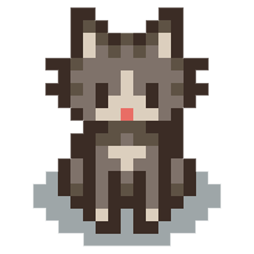

# Stardew Valley Mod Manager

A user-friendly desktop application that allows you to easily manage mods for your Stardew Valley game.



## Features

- 🔄 **Mod Management**: Activate, deactivate, and delete mods
- 🎮 **Game Launch**: Start Stardew Valley with SMAPI directly from the application
- 🌈 **Theme System**: Switch between different themes (Default, Barbie, Dark, Minecraft)
- 🌍 **Multi-language Support**: Turkish and English interface
- 📁 **Folder Access**: Quickly open mod and deactivated mod folders
- 📱 **Responsive Design**: Modern interface in pixel art style

## Installation

### Prerequisites

- [Stardew Valley](https://www.stardewvalley.net/) game
- [SMAPI](https://smapi.io/) (Stardew Valley mod loader)

### Download and Install

1. Download the latest version from the [Releases](https://github.com/merchizm/stardew-valley-mod-manager/releases) page
2. Run the downloaded file to complete the installation
3. Start the application

## Usage

### Mod Management

When the application starts, it will automatically try to find your Stardew Valley installation.

- **Activate Mods**: Select a mod from the deactivated mods list and click the "Activate" button
- **Deactivate Mods**: Select a mod from the active mods list and click the "Deactivate" button
- **Delete Mods**: Select any mod and click the "Delete" button (Deleted mods are moved to a temporary folder)

### Changing Themes

You can switch between different themes by selecting "Themes" from the top menu of the application:

- **Default**: Stardew Valley themed green tone
- **Barbie**: Pink and purple tones
- **Dark**: Modern dark theme
- **Minecraft**: Earth tones

### Changing Language

You can change the language preference by selecting "Language" from the top menu of the application:

- **Turkish**
- **English**

## Development

### Requirements

- [Node.js](https://nodejs.org/) (v14 or higher)
- [npm](https://www.npmjs.com/) (v6 or higher)

### Running the Project

```bash
# Clone the repository
git clone https://github.com/merchizm/stardew-valley-mod-manager.git

# Enter the project directory
cd stardew-valley-mod-manager

# Install dependencies
npm install

# Start the application
npm start

# Start in development mode
npm run dev
```

### Distribution

```bash
# To package the application
npm run build
```

## License

This project is licensed under the MIT License. See the [LICENSE](LICENSE) file for details.

## Contributing

Your contributions are welcome! Please create a Pull Request or open an Issue.

## Contact

For questions or suggestions, you can contact us via GitHub.

---

🌱 **Happy modding!** 🌱 